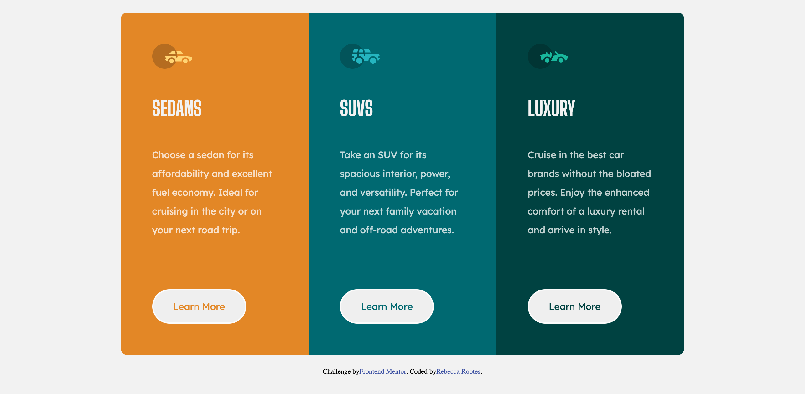

# Frontend Mentor - 3-column preview card component solution

This is a solution to the [3-column preview card component challenge on Frontend Mentor](https://www.frontendmentor.io/challenges/3column-preview-card-component-pH92eAR2-). Frontend Mentor challenges help you improve your coding skills by building realistic projects.

## Table of contents

- [Overview](#overview)
  - [Screenshots](#screenshots)
  - [Links](#links)
- [My process](#my-process)
  - [Built with](#built-with)
  - [Continued development](#continued-development)
  - [Useful resources](#useful-resources)
- [Author](#author)
- [Acknowledgments](#acknowledgments)

## Overview

### Screenshots

### Links

- Solution URL: [My Solution](https://beksterslab.github.io/3-column-preview-card-component-main/)

## My process

### Built with

- Semantic HTML5 markup
- CSS custom properties
- Flexbox

### Continued development

Further revision/work is required on flexbox layouts and look into using CSS Grid instead as it gives greater control over the layout.

### Useful resources

- [devPractical - How to Create a Responsive 3 Column Layout Flexbox CSS](https://devpractical.com/3-columns-flexbox-layout-css/) - I have used flexbox before but was struggling to get the three columns to keep equal widths rather than adjust to the width of the content. This provided the fix.

## Author

- Frontend Mentor - [@BekstersLab](https://www.frontendmentor.io/profile/BekstersLab)
